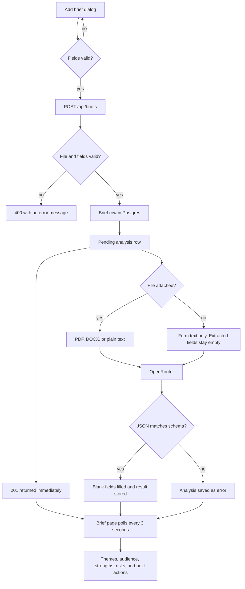

# Brief flow

How a brief moves from the add dialog through storage, analysis, and the brief page. The dialog posts the form to `POST /api/briefs`. The brief is stored and a pending analysis is queued before the response returns. The brief page polls until that run finishes.

Title is always required. A file is optional. With a file, the other fields may be blank and analysis can fill them. Without a file, description, content type, and target audience are required, notes stay optional, and the model is asked to leave extracted fields empty. Failures at each step are listed in [edge-cases.md](edge-cases.md).
